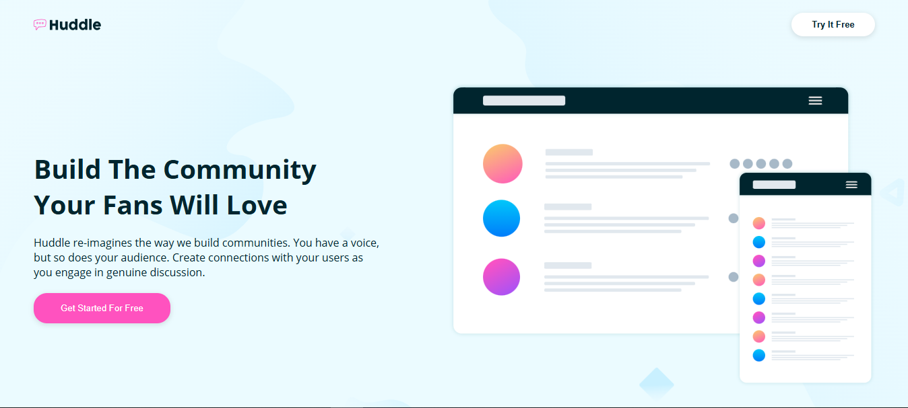

# صفحة هبوط Huddle 🚀

صفحة هبوط حديثة ومتجاوبة لـ Huddle، تم بناؤها باستخدام HTML وCSS وأفضل ممارسات تطوير الويب. يمكنك مشاهدة الموقع مباشرة من [هنا](https://asem-mamdoh.github.io/huddle-landing-page/).



## 🌟 المميزات

- تصميم متجاوب بالكامل
- واجهة مستخدم حديثة
- عناصر تفاعلية
- تكامل مع وسائل التواصل الاجتماعي
- نهج التصميم للموبايل أولاً

## 🛠️ تم البناء باستخدام

- HTML5
- CSS3
- Flexbox
- CSS Grid
- منهجية الموبايل أولاً

## 📱 التصميم المتجاوب

الصفحة متجاوبة بالكامل وتعمل بسلاسة على:
- الهواتف المحمولة
- الأجهزة اللوحية
- شاشات سطح المكتب

## 🎨 مميزات التصميم

- تخطيط نظيف وعصري
- قسم رئيسي جذاب
- أزرار دعوة للعمل
- روابط وسائل التواصل الاجتماعي
- صور محسنة

## 🚀 البدء في المشروع

1. استنسخ المستودع:
```bash
git clone https://github.com/asem-mamdoh/huddle-landing-page.git
```

2. انتقل إلى مجلد المشروع:
```bash
cd huddle-landing-page
```

3. افتح ملف `index.html` في متصفحك لعرض المشروع.

## 💻 التطوير

لتعديل المشروع:

1. افتح المشروع في محرر الكود المفضل لديك
2. قم بإجراء التغييرات على ملفات HTML (`index.html`) أو CSS (`main.css`)
3. قم بتحديث المتصفح لرؤية التغييرات

## 📝 هيكل المشروع

```
huddle-landing-page/
├── index.html
├── css/
│   └── style.css
├── images/
│   └── [ملفات الصور]
└── README.md
```

## 🌐 دعم المتصفحات

- كروم (أحدث إصدار)
- فايرفوكس (أحدث إصدار)
- سفاري (أحدث إصدار)
- إيدج (أحدث إصدار)

## 👤 المؤلف

- جيتهب: [@asem-mamdoh](https://github.com/asem-mamdoh)

## 🤝 المساهمة

نرحب بالمساهمات والاقتراحات وطلبات الميزات! لا تتردد في التحقق من [صفحة المشكلات](https://github.com/asem-mamdoh/huddle-landing-page/issues).

## ⭐ أظهر دعمك

امنحني ⭐️ إذا أعجبك هذا المشروع!

## 📝 الترخيص

هذا المشروع مفتوح المصدر ومتاح تحت [رخصة MIT](LICENSE).

## 🙏 شكر وتقدير

- الإلهام من التصميم: Frontend Mentor
- الأيقونات من: Font Awesome
- الخطوط من: Google Fonts